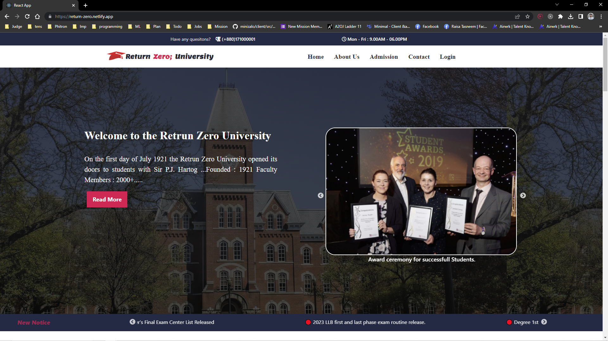

# Return Zero University

<p style="font-size:10px;"> On Going Project </p>


### Main Site Link

```
https://return-zero.netlify.app/
```

### Dashboard Link

```
https://dashboard-return-zero.netlify.app
```


## Used Technologies

[](#) [](#) [](#) [](#) [](#) [](#) [](#) [](#)

<h2>Overview</h2>

<p>An Education Institu Management System (EIMS) is a comprehensive software solution that is designed to streamline and automate the day-to-day operations of educational institutions. The system includes a wide range of features that can help manage student information, academic processes, administrative tasks, and financial transactions. Here is an overview of the features that could be included in an EIMS:
</p>

<ul>
<li>Student Management: This feature allows for the creation and management of student profiles, including personal information, academic records, attendance, and performance.</li>

<li>Course Management: This feature allows for the creation and management of course profiles, including course details, course materials, and course schedules.</li>

<li>Attendance Management: This feature allows for the creation and management of attendance records, including attendance details, attendance schedules, and attendance reports.</li>

<li>Academic Management: This feature manages the academic processes such as admissions, enrollment, scheduling, curriculum planning, lesson plans, and grading. </li>

<li>Faculty Management: This feature allows for the management of faculty profiles, including personal information, employment history, and performance evaluations. </li>

<li>Administrative Management: This feature includes the management of administrative tasks such as inventory, transportation, library, and event management.</li>

<li>Financial Management: This feature manages financial transactions such as tuition fees, scholarships, grants, and donations.</li>

<li>Reporting: This feature allows for the generation of reports that can be used for decision-making and planning purposes.</li>

<li>Communication and Collaboration: This feature facilitates communication and collaboration between students, faculty, parents, and administration. This can include messaging, notifications, and forums.</li>

<li>Reporting and Analytics: This feature generates reports and analytics on various aspects of the institution's performance such as student performance, faculty performance, and financial performance.</li>

</ul>

<p> Overall, an EIMS provides a one-stop solution for managing educational institutions. It can save time, reduce costs, and improve the overall efficiency of the institution.
</p>

## Home Page



## Dashboard


## Student List


